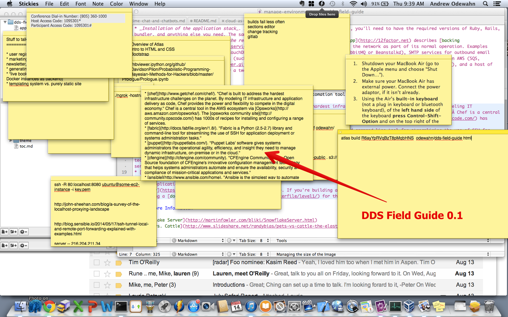

# Introduction

This project began while we were developing [Atlas](https://atlas.oreilly.com/), O'Reilly Media's next-generation publishing tool. It seemed like every day we were finding interesting new tools in the DevOps space, so I started a "Sticky" for the most interesting-looking tools so I could explore them later.  
 
    

At first, this worked fine. I was content to simply keep a list, where my only ordering criteria was "Huh, that looks cool. Someday when I have time, I'll take a look at that," in the same way you might buy an exercise DVD and then only occasionally pull it out and think "Huh, someday I'll get to that." But, as anyone who has watched DevOps for any length of time can tell you, it's a space bursting with interesting and exciting new tools, so my list and guilt quickly got out of hand.  

Once I reached the limits of the Sticky as a medium, I started to look for patterns in my list.  Some were obvious. For example, many of the tools, like Ansible, Salt, or (to a certain extent) Dockerfiles, fit into a clear infrastructure-automation group pioneered by Chef, CFEngine, and Puppet. So, too, the many cloud services.  

But where would something like CoreOS, Docker, or Mesos fit? As I thought about how to group them, they seemed somehow tied up with the notion of containerization, but that just seemed too narrow. Rather, these projects and tools were part of a much larger trend — enabling clustering and distributed computing—and containerization was just a piece. So, rather than group by technology, it made sense to me to group by trend—in other words, what did the tool enable, and why was that trend important?  

Simultaneously, other people at O'Reilly were also exploring this same question, but from a different perspective. In "[Everything is distributed](http://radar.oreilly.com/2014/05/everything-is-distributed.html)," Courtney Nash, the chair of [Velocity](http://velocityconf.com/), was asking "how do we manage systems that are too large to understand, too complex to control, and that fail in unpredictable ways." In "[Beyond the stack](http://radar.oreilly.com/2014/05/beyond-the-stack.html)," Mike Loukides was thinking about how "a new toolset has grown up to support the development of massively distributed applications," and described the profound consequences that the shift from well-tended, internal servers to disposable VMs was having on the traditional "LAMP" stack. (As well as its hipster cousin, the [MEAN stack](http://meanjs.org/).)  

So, it's from this context that my Sticky list grew into this [Field Guide to the Distributed Development Stack](http://sites.oreilly.com/odewahn/dds-field-guide/). The Guide is organized into buckets based on a general observation, such as:

* [The cloud is the default platform](http://sites.oreilly.com/odewahn/dds-field-guide/ch02.html)
* [CI servers deploy code, not ops](http://sites.oreilly.com/odewahn/dds-field-guide/ch03.html)
* [The codebase is in git](http://sites.oreilly.com/odewahn/dds-field-guide/ch04.html)
* [The entire application runs locally in development](http://sites.oreilly.com/odewahn/dds-field-guide/ch05.html)
* [The environment is automated in the code](http://sites.oreilly.com/odewahn/dds-field-guide/ch06.html)
* [The monitoring infrastructure is critical](http://sites.oreilly.com/odewahn/dds-field-guide/ch07.html)
* [Tests done in code, not by a QA department](http://sites.oreilly.com/odewahn/dds-field-guide/ch08.html)

In addition to being a (hopefully) useful framework, the Guide is also meant to be a living resource. So, [we've put the source on GitHub](https://github.com/odewahn/dds-field-guide) and invite you to contribute. If you feel like we've missed a tool (which we most certainly have, since new things are popping up every day) or a major theme, then fork the repo and send me a pull request. We'll be keeping this document up to date and republishing it as we watch this trend continue to grow.  We'll use [O'Reilly Atlas](https://atlas.oreilly.com) to pull in the contributions and periodically republish the guide.

This is still very much a work-in-progress, but I hope it will be a resource you'll add to your own Sticky collection.

## How to Contribute

To contribute to the DDS field guide:
* Fork this repo
* Agree to the [O'Reilly Contributor License Agreement](http://contributor-agreements.oreilly.com/)
* Add your tool / contribution
* Submit a pull request

If your request is accepted, we'll add you to the Contributors page.

### Making a larger contribution

If you want to make a suggestion or contribution that is larger than just a single tool, it might make sense to begin the conversation as a GitHub issue, rather than a pull request. For example, if you want to add a new theme, or want to add a major narrative section, it would be good to discuss that first to make sure it's suitable for the guide. While I certainly don't want to limit what people contribute in any way, it's also the case that this guide will be centrally curated by me and other O'Reilly contributors.
 
