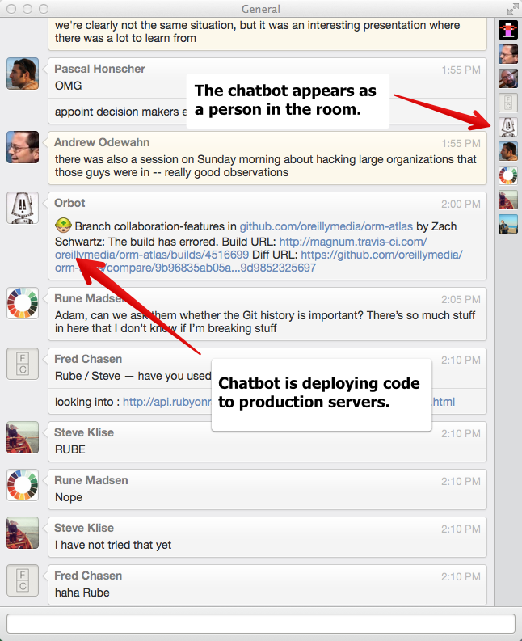

# Real-time Chat and Chatbots

Once considered a relic of a bygone era, real-time chat systems are now a huge part of the workflow of most distributed teams.  Like texting, chat allows developers to send each other messages in real time and is the place where most routine team communication takes place.  (It can be the place where the team culture is formed and maintained.)

In addition to human participants, team chats can include a _chatbot_, which is a program that performs useful functions by monitoring the chatroom for special commands.  The chatbot, which appears like anyone else in the room, can do routine tasks such as kicking off a build, locking the production server, reporting errors from the monitoring tools, or providing manpages.  And, programmers being programmers, the chatbot can also do things that reflect the culture of the team, like showing pictures of a pug, displaying a squirrel whenever you type "ship it," or providing responses in a Magic 8 Ball form when you ask it questions.  The chatbot usually reflects the culture of the team that's using it and can often become an informal mascot for the group.

## Chat

These are some of the more popular chat services and resources:

* [Campfire](https://campfirenow.com/)
* [HipChat](https://www.hipchat.com)
* [Slack](https://slack.com/)
* [SoCoCo](https://www.sococo.com/)
* Google Chat
* [The Emoji Cheatsheet](http://www.emoji-cheat-sheet.com/) is a fun resource that lists text shortcuts that correspond to the emoji characters used in many chat services.  For example, using the code ":boom:" creates a small explosion icon when it's rendered in chat.

## Chatbots

These are resources for creating chatbots:

* [Hubot](https://hubot.github.com/) is a Node.js chatbot engine from GitHub.  It provides the essential services like logging into the char service, listening for commands directed its way, executing corresponding scripts, and returning output.
* [Hubot Script Catalog](http://hubot-script-catalog.herokuapp.com/) is a directory of useful (and totally useless!) scripts that can be plugged into the Hubot framework.

## For More Information

* [Say "Hello" to Hubot](https://github.com/blog/968-say-hello-to-hubot) is a blog post from GitHub, the company that developed the popular Hubot chatbot.
* [ChatOps at GitHub](https://www.youtube.com/watch?v=NST3u-GjjFw) is a video explaining the chatbot-based ops workflow at GitHub.
